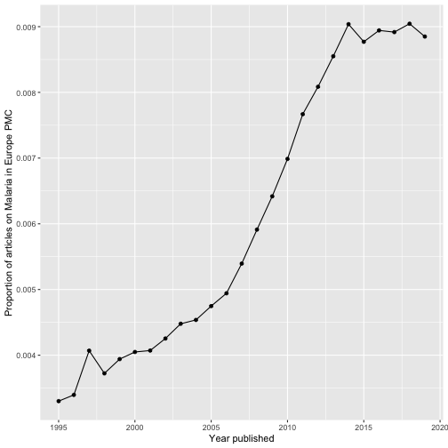

europepmc - R Interface to Europe PMC RESTful Web Service
=== 


[](https://github.com/ropensci/europepmc/actions)
[](https://ci.appveyor.com/project/sckott/europepmc)
[](https://app.codecov.io/github/ropensci/europepmc?branch=master)
[](https://cran.r-project.org/package=europepmc)
[](https://github.com/r-hub/cranlogs.app)
[](https://github.com/ropensci/software-review/issues/29)

europepmc facilitates access to the [Europe PMC RESTful Web
Service](https://europepmc.org/RestfulWebService). The client furthermore supports the [Europe PMC Annotations API](https://europepmc.org/AnnotationsApi) to retrieve text-mined concepts and terms per article.

[Europe PMC](https://europepmc.org/) covers life science literature and
gives access to open access full texts. Europe
PMC ingests all PubMed content and extends its index with other literature and patent sources.

For more infos on Europe PMC, see:

<https://europepmc.org/About>

Ferguson, C., Araújo, D., Faulk, L., Gou, Y., Hamelers, A., Huang, Z., 
Ide-Smith, M., Levchenko, M., Marinos, N., Nambiar, R., Nassar, M., Parkin, M., Pi, X., Rahman, F., Rogers, F., Roochun, Y., Saha, S., Selim, M., Shafique, Z., … McEntyre, J. (2020). Europe PMC in 2020. Nucleic Acids Research, 49(D1), D1507–D1514. <https://doi.org/10.1093/nar/gkaa994>.

## Implemented API methods

This client supports the following API methods from the [Articles RESTful API](https://europepmc.org/RestfulWebService):

|API-Method     |Description                                                                                  |R functions                                |
|:--------------|:--------------------------------------------------------------------------------------------|:------------------------------------------|
|search         |Search Europe PMC and get detailed metadata                                                  |`epmc_search()`, `epmc_details()`, `epmc_search_by_doi()`          |
|profile        |Obtain a summary of hit counts for several Europe PMC databases                              |`epmc_profile()`                           |
|citations      |Load metadata representing citing articles for a given publication                           |`epmc_citations()`                         |
|references     |Retrieve the reference section of a publication                                               |`epmc_refs()`                              |
|databaseLinks  |Get links to biological databases such as UniProt or ENA                                     |`epmc_db()`, `epmc_db_count()`             |
|labslinks      |Access links to Europe PMC provided by third parties                                         |`epmc_lablinks()`, `epmc_lablinks_count()` |
|fullTextXML    |Fetch full-texts deposited in PMC                                                            |`epmc_ftxt()`                              |
|bookXML        |retrieve book XML formatted full text for the Open Access subset of the Europe PMC bookshelf |`epmc_ftxt_book()`                         |

From the [Europe PMC Annotations API](https://europepmc.org/AnnotationsApi):

|API-Method     |Description |R functions |
|:-----------|:-------------|:-------------|
annotationsByArticleIds | Get the annotations contained in the list of articles specified | `epmc_annotations_by_id()` |

## Installation

From CRAN

```r
install.packages("europepmc")
```

The latest development version can be installed using the
[remotes](https://github.com/r-lib/remotes/) package:


```r
require(remotes)
install_github("ropensci/europepmc")
```

Loading into R


```r
library(europepmc)
```

## Search Europe PMC

The search covers both metadata (e.g. abstracts or title) and full texts. To
build your query, please refer to the comprehensive guidance on how to search
Europe PMC: <https://europepmc.org/help>. Provide your query in the Europe
PMC search syntax to `epmc_search()`. 


```r
europepmc::epmc_search(query = '"2019-nCoV" OR "2019nCoV"')
#> # A tibble: 100 × 29
#>    id        source pmid     pmcid   doi   title authorString journalTitle issue
#>    <chr>     <chr>  <chr>    <chr>   <chr> <chr> <chr>        <chr>        <chr>
#>  1 36754560  MED    36754560 PMC992… 10.1… Inno… Yerlikaya S… BMJ Open     2    
#>  2 37400836  MED    37400836 PMC103… 10.1… Effe… Ebrahimi T,… BMC Oral He… 1    
#>  3 37223279  MED    37223279 PMC101… 10.1… Bill… Lamsal R, R… Data Brief   <NA> 
#>  4 36727245  MED    36727245 PMC101… 10.1… Vasc… Morrissey E… JBI Evid Sy… 5    
#>  5 37211453  MED    37211453 PMC101… 10.1… Safe… Smith K, He… Vaccine      26   
#>  6 PPR525786 PPR    <NA>     <NA>    10.1… The … Alihsan B, … <NA>         <NA> 
#>  7 PPR621660 PPR    <NA>     <NA>    10.1… Safe… Smith K, He… <NA>         <NA> 
#>  8 36679914  MED    36679914 PMC986… 10.3… The … Cherif YYS,… Vaccines (B… 1    
#>  9 PPR689808 PPR    <NA>     <NA>    10.2… Perf… MOUNA L, BO… <NA>         <NA> 
#> 10 37258070  MED    37258070 PMC102… 10.1… Comp… Hui L, Garn… BMJ Open     5    
#> # ℹ 90 more rows
#> # ℹ 20 more variables: journalVolume <chr>, pubYear <chr>, journalIssn <chr>,
#> #   pageInfo <chr>, pubType <chr>, isOpenAccess <chr>, inEPMC <chr>,
#> #   inPMC <chr>, hasPDF <chr>, hasBook <chr>, hasSuppl <chr>,
#> #   citedByCount <int>, hasReferences <chr>, hasTextMinedTerms <chr>,
#> #   hasDbCrossReferences <chr>, hasLabsLinks <chr>,
#> #   hasTMAccessionNumbers <chr>, firstIndexDate <chr>, …
```

Be aware that Europe PMC expands queries with MeSH synonyms by default. You can turn this behavior off using the `synonym = FALSE` parameter.

By default, `epmc_search()` returns 100 records. To adjust the limit, simply use
the `limit` parameter.

See vignette [Introducing europepmc, an R interface to Europe PMC RESTful API](https://docs.ropensci.org/europepmc/articles/introducing-europepmc.html) for a long-form documentation about how to search Europe PMC with this client.

## Creating proper review graphs with `epmc_hits_trend()`

There is also a nice function allowing you to easily create review graphs like described in Maëlle
Salmon's [blog post](https://masalmon.eu/2017/05/14/evergreenreviewgraph/):


```r
tt_oa <- europepmc::epmc_hits_trend("Malaria", period = 1995:2019, synonym = FALSE)
tt_oa
#> # A tibble: 25 × 3
#>     year all_hits query_hits
#>    <int>    <dbl>      <dbl>
#>  1  1995   449216       1471
#>  2  1996   458644       1529
#>  3  1997   456805       1834
#>  4  1998   474695       1756
#>  5  1999   493837       1951
#>  6  2000   532142       2078
#>  7  2001   545709       2179
#>  8  2002   561496       2350
#>  9  2003   588612       2596
#> 10  2004   628192       2830
#> # ℹ 15 more rows
# we use ggplot2 for plotting the graph
library(ggplot2)
ggplot(tt_oa, aes(year, query_hits / all_hits)) + 
  geom_point() + 
  geom_line() +
  xlab("Year published") + 
  ylab("Proportion of articles on Malaria in Europe PMC")
```



For more info, read the vignette about creating literature review graphs:

<https://docs.ropensci.org/europepmc/articles/evergreenreviewgraphs.html>

## Re-use of europepmc

Check out the tidypmc package

<https://github.com/ropensci/tidypmc>

The package maintainer, Chris Stubben (@cstubben), has also created an Shiny App that allows you to search and browse Europe PMC:

<https://github.com/cstubben/euPMC>


## Other ways to access Europe PubMed Central

### Other APIs

- Data dumps: <https://europepmc.org/FtpSite>
- OAI service: <https://europepmc.org/OaiService>
- SOAP web service: <https://europepmc.org/SoapWebServices>
- Grants RESTful (Grist) API: <https://europepmc.org/GristAPI>

### Other R clients

- use rOpenSci's `oai` to get metadata and full text via Europe PMC's OAI interface: <https://github.com/ropensci/oai>
- use rOpenSci's `rentrez` to interact with [NCBI databases](https://www.ncbi.nlm.nih.gov/) such as PubMed: <https://github.com/ropensci/rentrez>
- rOpenSci's `fulltext` package gives access to supplementary material of open access life-science publications in Europe PMC: <https://github.com/ropensci-archive/fulltext>

## Meta

Please note that this project is released with a [Contributor Code of Conduct](https://docs.ropensci.org/europepmc/CONDUCT.html). By participating in this project you agree to abide by its terms.

License: GPL-3

Please use the issue tracker for bug reporting and feature requests.

---

[](https://ropensci.org)
