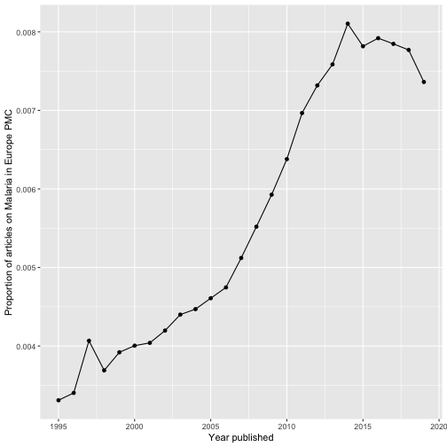

# europepmc - R Interface to Europe PMC RESTful Web Service


[](https://travis-ci.org/ropensci/europepmc)
[](https://ci.appveyor.com/project/sckott/europepmc)
[](https://codecov.io/github/ropensci/europepmc?branch=master)
[](https://cran.r-project.org/package=europepmc)
[](https://github.com/metacran/cranlogs.app)
[](https://github.com/ropensci/onboarding/issues/29)

europepmc facilitates access to the [Europe PMC RESTful Web
Service](http://europepmc.org/RestfulWebService).

[Europe PMC](http://europepmc.org/) covers life science literature and
gives access to open access full texts. Europe
PMC ingests all PubMed content and extends its index with other sources,
including Agricola, a bibliographic database of citations to the agricultural
literature, or Biological Patents.

For more infos on Europe PMC, see:

<https://europepmc.org/About>

Europe PMC: a full-text literature database for the life sciences and platform
for innovation. (2014). Nucleic Acids Research, 43(D1), D1042–D1048. doi:[10.1093/nar/gku1061](http://doi.org/10.1093/nar/gku1061)

## Implemented API methods

This client supports the following API methods:

|API-Method     |Description                                                                                  |R functions                                |
|:--------------|:--------------------------------------------------------------------------------------------|:------------------------------------------|
|search         |Search Europe PMC and get detailed metadata                                                  |`epmc_search()`, `epmc_details()`          |
|profile        |Obtain a summary of hit counts for several Europe PMC databases                              |`epmc_profile()`, `epmc_profile_hits()`                           |
|citations      |Load metadata representing citing articles for a given publication                           |`epmc_citations()`                         |
|references     |Retrieve the reference section of a pubication                                               |`epmc_refs()`                              |
|databaseLinks  |Get links to biological databases such as UniProt or ENA                                     |`epmc_db()`, `epmc_db_count()`             |
|labslinks      |Access links to Europe PMC provided by third parties                                         |`epmc_lablinks()`, `epmc_lablinks_count()` |
|textMinedTerms |Retrieve text-mined terms                                                                    |`epmc_tm()`, `epmc_tm_count()`             |
|fullTextXML    |Fetch full-texts deposited in PMC                                                            |`epmc_ftxt()`                              |
|bookXML        |retrieve book XML formatted full text for the Open Access subset of the Europe PMC bookshelf |`epmc_ftxt_book()`                         |

## Installation

From CRAN

```r
install.packages("europepmc")
```

The latest development version can be installed using
[devtools](https://github.com/hadley/devtools) package:


```r
require(devtools)
install_github("ropensci/europepmc")
```

Loading into R


```r
library(europepmc)
```

## Search Europe PMC

The search covers both metadata (e.g. abstracts or title) and full texts. To
build your query, please refer to the comprehensive guidance on how to search
Europe PMC: <http://europepmc.org/help>. Simply provide your query in the Europe
PMC search syntax to `epmc_search()`. 


```r
europepmc::epmc_search("Lagotto Romagnolo")
#> # A tibble: 39 x 27
#>          id source     pmid                                doi
#>       <chr>  <chr>    <chr>                              <chr>
#>  1 28583040    MED 28583040           10.1177/0300985817712793
#>  2 25945683    MED 25945683                 10.1111/jvim.12611
#>  3 24354474    MED 24354474                  10.1111/vru.12129
#>  4 17552452    MED 17552452 10.1111/j.1939-1676.2007.tb02991.x
#>  5 17490444    MED 17490444   10.1111/j.1748-5827.2006.00298.x
#>  6 29056526    MED 29056526       10.1016/j.beproc.2017.10.009
#>  7 27525650    MED 27525650       10.1371/journal.pone.0161005
#>  8 29166669    MED 29166669       10.1371/journal.pone.0188543
#>  9 25875846    MED 25875846       10.1371/journal.pgen.1005169
#> 10 26316206    MED 26316206          10.1186/s12917-015-0463-0
#> # ... with 29 more rows, and 23 more variables: title <chr>,
#> #   authorString <chr>, journalTitle <chr>, issue <chr>,
#> #   journalVolume <chr>, pubYear <chr>, journalIssn <chr>, pageInfo <chr>,
#> #   pubType <chr>, isOpenAccess <chr>, inEPMC <chr>, inPMC <chr>,
#> #   hasPDF <chr>, hasBook <chr>, citedByCount <int>, hasReferences <chr>,
#> #   hasTextMinedTerms <chr>, hasDbCrossReferences <chr>,
#> #   hasLabsLinks <chr>, hasTMAccessionNumbers <chr>,
#> #   firstPublicationDate <chr>, pmcid <chr>, hasSuppl <chr>
```

By default, `epmc_search()` returns 100 records. To adjust the limit, simply use
the `limit` parameter.

See vignette [Introducing europepmc, an R interface to Europe PMC RESTful API](https://ropensci.github.io/europepmc/articles/introducing-europepmc.html) for a long-form documentation about how to search Europe PMC with this client.

## Creating proper review graphs with `epmc_hits_trend()`

There is also a nice function allowing you to easily create review graphs like described in Maëlle
Salmon's [blog post](http://www.masalmon.eu/2017/05/14/evergreenreviewgraph/):


```r
tt_oa <- europepmc::epmc_hits_trend("Malaria", period = 1995:2016, synonym = FALSE)
tt_oa
#> # A tibble: 22 x 3
#>     year all_hits query_hits
#>    <int>    <dbl>      <dbl>
#>  1  1995   448144       1485
#>  2  1996   457900       1560
#>  3  1997   455662       1853
#>  4  1998   473286       1749
#>  5  1999   492990       1935
#>  6  2000   531375       2127
#>  7  2001   544462       2203
#>  8  2002   560839       2352
#>  9  2003   587527       2553
#> 10  2004   627139       2748
#> # ... with 12 more rows
# we use ggplot2 for plotting the graph
library(ggplot2)
ggplot(tt_oa, aes(year, query_hits / all_hits)) + 
  geom_point() + 
  geom_line() +
  xlab("Year published") + 
  ylab("Proportion of articles on Malaria in Europe PMC")
```



For more info, read the vignette about creating literature review graphs:

<https://ropensci.github.io/europepmc/articles/evergreenreviewgraphs.html>

## Re-use of europepmc

Chris Stubben (@cstubben) has created an Shiny App that allows you to search and
browse Europe PMC:

<https://cstubben.shinyapps.io/euPMC/>

## Other ways to access Europe PubMed Central

### Other APIs

- Data dumps: <https://europepmc.org/FtpSite>
- OAI service: <https://europepmc.org/OaiService>
- SOAP web service: <https://europepmc.org/SoapWebServices>
- Grants RESTful (Grist) API: <https://europepmc.org/GristAPI>

### Other R clients

- use rOpenSci's `oai` to get metadata and full text via Europe PMC's OAI interface: <https://github.com/ropensci/oai>
- use rOpenSci's `rentrez` to interact with [NCBI databases](http://www.ncbi.nlm.nih.gov/) such as [PubMed](http://www.ncbi.nlm.nih.gov/pubmed): <https://github.com/ropensci/rentrez>
- rOpenSci's `fulltext` package gives access to supplementary material of open access life-science publications in Europe PMC: <https://github.com/ropensci/fulltext>

## Meta

Please note that this project is released with a [Contributor Code of Conduct](CONDUCT.md). By participating in this project you agree to abide by its terms.

License: GPL-3

Please use the issue tracker for bug reporting and feature requests.

---

[](http://ropensci.org)
