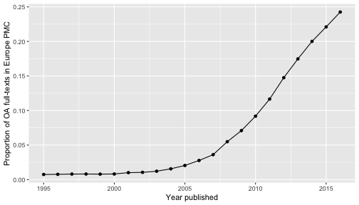
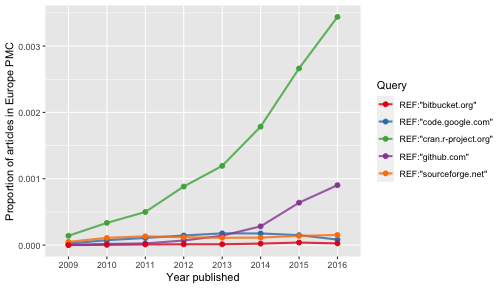

Trend graphs in literature reviews show the development of concepts in scholarly communication. Some trend graphs, however, don't acknowledge that the number of scholarly publications is growing each year, but simply display the absolute number of hits they have found for a given concept. Noam Ross called these misleading graphs evergreen review graphs because of their enduring popularity in  review papers.

This vignette guides you how to make proper trend graphs when reviewing Europe PMC literature. In these graphs, the number of hits found is divided by the total number of records indexed in Europe PMC for a given search query.

## Preparing proper review graphs with `epmc_hits_trend()`

We use `epmc_hits_trend()` function, which was firstly introduced in Maëlle Salmon's blog post about "How not to make an evergreen review graph"[^1]. The function takes a query in the Europe PMC search syntax[^2] and the period of years over which to perform the search as arguments, and returns a data-frame with year, total number of hits (`all_hits`) and number of hits for the query (`query_hits`).


```r
library(europepmc)
europepmc::epmc_hits_trend(query = "aspirin", period = 2010:2022)
#> # A tibble: 13 × 3
#>     year all_hits query_hits
#>    <int>    <dbl>      <dbl>
#>  1  2010   851063       5507
#>  2  2011   904794       6003
#>  3  2012   946175       6833
#>  4  2013  1004386       7652
#>  5  2014  1055159       8210
#>  6  2015  1096370       8779
#>  7  2016  1117117       8950
#>  8  2017  1138383       9394
#>  9  2018  1180056      10103
#> 10  2019  1243536      10666
#> 11  2020  1450476      14294
#> 12  2021  1549953      16643
#> 13  2022  1542398      15975
```

By default, synonym search is disabled and only Medline/PubMed index is searched.

[^1]: <https://masalmon.eu/2017/05/14/evergreenreviewgraph/>

[^2]: Europe PMC Search Syntax: <https://europepmc.org/Help#mostofsearch>

## Use Cases

### Use Case: Growth of Open Access Literature

There is a growing interest in knowing the proportion of open access to scholarly literature. Europe PMC allows searching for open access content with the [`OPEN_ACCESS:Y` parameter](https://europepmc.org/search?query=OPEN_ACCESS:Y&page=1&sortby=Relevance). At the moment, Europe PMC contains 5,509,277 open access full-texts. Let's see how they are relatively distributed over the period 2010 - 2022.


```r
tt_oa <- europepmc::epmc_hits_trend("OPEN_ACCESS:Y", period = 2010:2022, synonym = FALSE)
tt_oa
#> # A tibble: 13 × 3
#>     year all_hits query_hits
#>    <int>    <dbl>      <dbl>
#>  1  2010   851063      78677
#>  2  2011   904794     105675
#>  3  2012   946175     140016
#>  4  2013  1004386     176541
#>  5  2014  1055159     212039
#>  6  2015  1096370     244234
#>  7  2016  1117117     273364
#>  8  2017  1138383     312717
#>  9  2018  1180056     352067
#> 10  2019  1243536     405927
#> 11  2020  1450476     585116
#> 12  2021  1549953     714017
#> 13  2022  1542398     790600
# we use ggplot2 for plotting the graph
library(ggplot2)
ggplot(tt_oa, aes(factor(year), query_hits / all_hits, group = 1)) +
  geom_point() +
  geom_line() +
  xlab("Year published") +
  ylab("Proportion of OA full-texts in Europe PMC")
```

<div class="figure" style="text-align: center">

<p class="caption">plot of chunk oa_pmc</p>
</div>

Be careful with the interpretation of the slower growth in the last years because there are several ways how open access content is added to Europe PMC including the digitalization of back issues.[^3]

[^3]: See section "Content Growth" in: McEntyre JR, Ananiadou S, Andrews S, et al. UKPMC: a full text article resource
    for the life sciences. *Nucleic Acids Research*. 2011;39(Database):D58–D65. <https://doi.org/10.1093/nar/gkq1063>.

### Use Case: Cited open source software in scholarly publications

Another nice use case for trend graphs is to study how code and software repositories are cited in scientific literature. In recent years, it has become a good practice not only to re-use openly available software, but also to cite them. The FORCE11 Software Citation Working Group states:

> In general, we believe that software should be cited on the same basis as any other research product such as a paper or book; that is, authors should cite the appropriate set of software products just as they cite the appropriate set of papers. [(doi:10.7717/peerj-cs.86)](https://doi.org/10.7717/peerj-cs.86)

So let's see whether we can find evidence for this evolving practice by creating a proper review graph. As a start, we examine these four general purpose hosting services for version-controlled code:

- [code.google.com](https://code.google.com/)
- [github.com](https://github.com/)
- [sourceforge.net](https://sourceforge.net/)
- [bitbucket.org](https://bitbucket.org/)

and, of course, [CRAN](https://cran.r-project.org/), the R archive network.

#### How to query Europe PMC?

We only want to search reference lists. Because Europe PMC does not index references for its complete collection, we use `has_reflist:y` to restrict our search to those publications with reference lists. These literature sections can be searched with the `REF:` parameter.

Let's prepare the queries for links to the above mentioned code hosting services:


```r
dvcs <- c("code.google.com", "github.com",
          "sourceforge.net", "bitbucket.org", "cran.r-project.org")
# make queries including reference section
dvcs_query <- paste0('REF:"', dvcs, '"')
```

and get publications for which Europe PMC gives access to reference lists for normalizing the review graph.


```r
library(dplyr)
my_df <- purrr::map_df(dvcs_query, function(x) {
  # get number of publications with indexed reference lists
  refs_hits <-
    europepmc::epmc_hits_trend("has_reflist:y", period = 2009:2022, synonym = FALSE)$query_hits
  # get hit count querying for code repositories
  europepmc::epmc_hits_trend(x, period = 2009:2022, synonym = FALSE) %>%
    dplyr::mutate(query_id = x) %>%
    dplyr::mutate(refs_hits = refs_hits) %>%
    dplyr::select(year, all_hits, refs_hits, query_hits, query_id)
})
my_df
#> # A tibble: 70 × 5
#>     year all_hits refs_hits query_hits query_id                 
#>    <int>    <dbl>     <dbl>      <dbl> <chr>                    
#>  1  2009   793211    555994         13 "REF:\"code.google.com\""
#>  2  2010   851063    541440         40 "REF:\"code.google.com\""
#>  3  2011   904794    604311         65 "REF:\"code.google.com\""
#>  4  2012   946175    636818         92 "REF:\"code.google.com\""
#>  5  2013  1004386    763699        135 "REF:\"code.google.com\""
#>  6  2014  1055159    797691        140 "REF:\"code.google.com\""
#>  7  2015  1096370    780509        117 "REF:\"code.google.com\""
#>  8  2016  1117117    783865         65 "REF:\"code.google.com\""
#>  9  2017  1138383    819481         52 "REF:\"code.google.com\""
#> 10  2018  1180056    757547         29 "REF:\"code.google.com\""
#> # ℹ 60 more rows

### total
hits_summary <- my_df %>%
  group_by(query_id) %>%
  summarise(all = sum(query_hits)) %>%
  arrange(desc(all))
hits_summary
#> # A tibble: 5 × 2
#>   query_id                       all
#>   <chr>                        <dbl>
#> 1 "REF:\"cran.r-project.org\"" 44677
#> 2 "REF:\"github.com\""         28886
#> 3 "REF:\"sourceforge.net\""     1777
#> 4 "REF:\"code.google.com\""      896
#> 5 "REF:\"bitbucket.org\""        440
```

The proportion of papers where Europe PMC was able to make the cited literature available was 63 for the period 2009-2022. There also seems to be a time-lag between indexing reference lists because the absolute number of publication was decreasing over the years. This is presumably because Europe PMC also includes delayed open access content, i.e. content which is not added immediately with the original publication.[^4]

[^4]: Ebd.

Now, let's make a proper review graph normalizing our query results with the number of publications with indexed references.


```r
library(ggplot2)
ggplot(my_df, aes(factor(year), query_hits / refs_hits, group = query_id,
                  color = query_id)) +
  geom_line(size = 1, alpha = 0.8) +
  geom_point(size = 2) +
  scale_color_brewer(name = "Query", palette = "Set1")+
  xlab("Year published") +
  ylab("Proportion of articles in Europe PMC")
```

<div class="figure" style="text-align: center">

<p class="caption">plot of chunk software_lit</p>
</div>

#### Discussion and Conclusion

Although this figure illustrates the relative popularity of citing code hosted by CRAN and GitHub in recent years, there are some limits that needs to be discussed. As said before, Europe PMC does not extract reference lists from every indexed publication. It furthermore remains open whether and to what extent software is cited outside the reference section, i.e. as footnote or in the acknowledgements.

Another problem of our query approach is that we did not consider that DOIs can also be used to cite software, a best-practice implemented by [Zenodo and GitHub](https://docs.github.com/repositories/archiving-a-github-repository/referencing-and-citing-content) or the [The Journal of Open Source Software](https://joss.theoj.org/).

Lastly, it actually remains unclear, which and what kind of software is cited how often. We could also not control if authors just cited the homepages and not a particular source code repository. One paper can also cite more than one code repository, which is also not represented in the trend graph.

To conclude, a proper trend graph on the extent of software citation can only be the start for a more sophisticated approach that mines links to software repositories from scientific literature and fetches metadata about these code repositories from the hosting facilities.

## Conclusion

This vignette presented first steps on how to make trend graphs with `europepmc`. As our use-cases suggest, please carefully consider how you queried Europe PMC in the interpretation of your graph. Although trend graphs are a nice way to illustrate the development of certain concepts in scientific literature or recent trends in scholarly communication, they must be put in context in order to become meaningful.

## Acknowledgements

Big thanks to Maëlle Salmon for getting me started to write this vignette.
